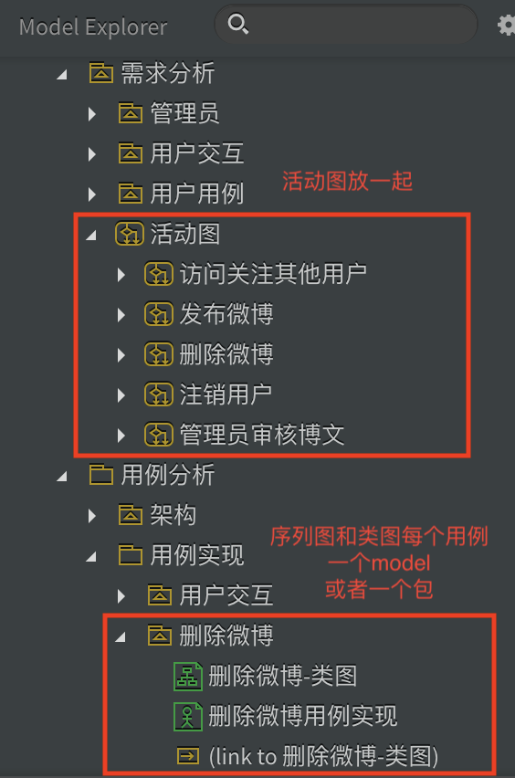
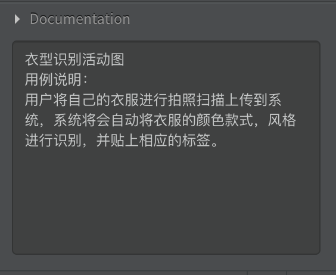

# 软件工程课程设计_文档格式规范

## 文档格式约定

文档命名：文档名称+自己负责的部分+名字（例如：需求分析规约\_运行模块分析\_媚），方便汇总的人有疑问的时候可以提问

|        | 字体     | 字号 | 特殊要求 | 排版 |
| ------ | -------- | ---- | -------- | ---- |
| 标题1: | 华文楷体 |      |          |      |
| 标题2: | 华文楷体 |      |          |      |
| 标题3: | 华文楷体 |      |          |      |
| 标题4: |          |      |          |      |
| 目录： |          |      |          |      |
| 题注： |          |      |          |      |
| 正文： |          |      |          |      |

1. 目录采用自动目录正式版，目录只显示到二级标题
2. 正文首行需要缩进2个字符
3. 大纲之间各级标题没有悬挂缩进

## uml画图格式约定

1. 命名格式：用例名称+图类别（统一用英文吧，命名方式是驼峰式，例如：logInActivityDiagram)

2. 类直接从类图那个文件夹拖出来，不要自己画，如果有新加的类请跟汇总的同学说明或者在类图的文档里给出说明提醒

3. 为了方便整合，请先自行建立一个model，然后把要画的图都放在建立的model里

   

   这个是我们的图的组织结构，可以参考一下

   ### ————以下为12.4更新内容————

4. 请在图的文档里说明该图对应的用例，如有特殊说明，也请一并放在文档里，文档包含：

   - 图的种类
   - 图对应的用例
   - 图对应的用例说明
   - 备注（特殊说明）【选填】

5. 请注意用例的名字与用例图相对应

   ### ————以下为12.5更新内容————

6. uml类名，边界类surface，控制类control

7. 统一一下代码命名格式（函数名形式（即我们发送的消息的名称），下划线连接，例如 sign_in()

8. 把自己画的图放在一个包里面，这样我可以直接导出

   ### ————以下为12.11更新内容————

9. 使用名称需与用例图中保持一致，以最近的3.0版本为准

10. 在图（**子类图，活动图，序列图，状态图**）对应的documentation部分加上该图的说明，包括图的名称，种类，所对应的用例及用例说明，例如：

   

   ## 代码格式约定

   1. 画好继承体系类图，按照类图继承
   2. 统一命名，命名规范包括：
      1. 项目命名
      2. 包命名
      3. 类命名、成员变量命名
      4. 资源文件命名
   3. 一定要加注释❗️❗️❗️
